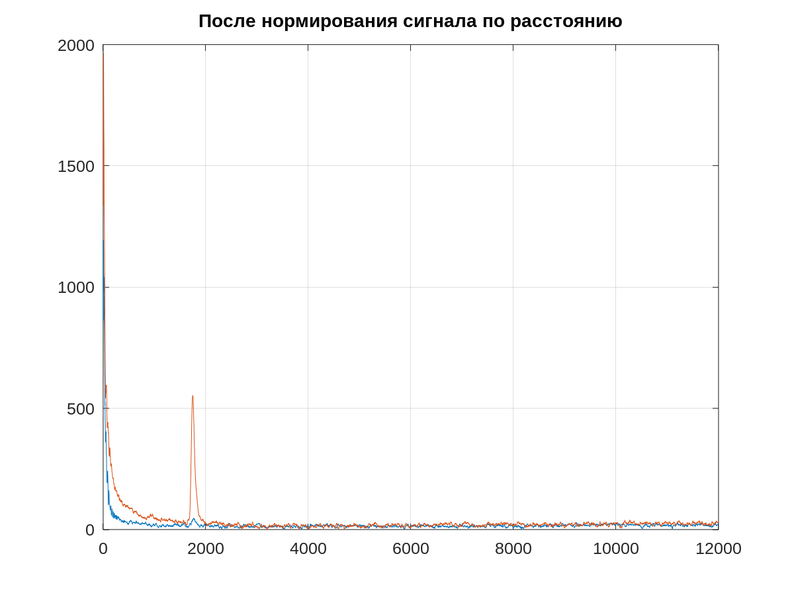

<h2>Алгоритм по обработке сигналов</h2>

Основная часть кода приведена на c++(c++17). Для простоты визуализации
различных стадий работы алгоритма также приведена реализация его
на языке Octave с соответствующими графиками для каждой стадии.
<h3>Работа алгоритма на примере файла "2017-04-11_-_14-06-06_4_raw.csv":</h3>
<h5>Сырые данные с двух каналов:</h5>


<h5>Результат удаления шума:</h5>


<h5>Результат удаления нулевой дорожки:</h5>


<h5>Результат инвертирования каналов:</h5>


<h5>Результат инвертирования каналов:</h5>


<h5>После нормирования каналов:</h5>


<h5>Результат применения медианного фильтра с окном в 3 элемента:</h5>


<h5>Конечный результат:</h5>


<h4>Аргументы программы:</h4> <br>
```bash
./TestExc -h
Allowed options:
-h [ --help ]         produce help message
-S [ --signals ] arg  Input .csv signal files
-N [ --noise ] arg    Input .csv noise file
```
Каждый входной файла с сигналом обрабатывается в отдельном потоке.

<h4>Зависимости: </h4>
```bash
Boost.Program_options (1.58),
glm(0.9.9.8)
```
<h4>Установка с помощью cmake:</h4>
```cmake
git clone Вставить название 
cd TestExc
mkdir build && cd build
cmake -DCMAKE_BUILD_TYPE=Release ..
make -j<n>
```
